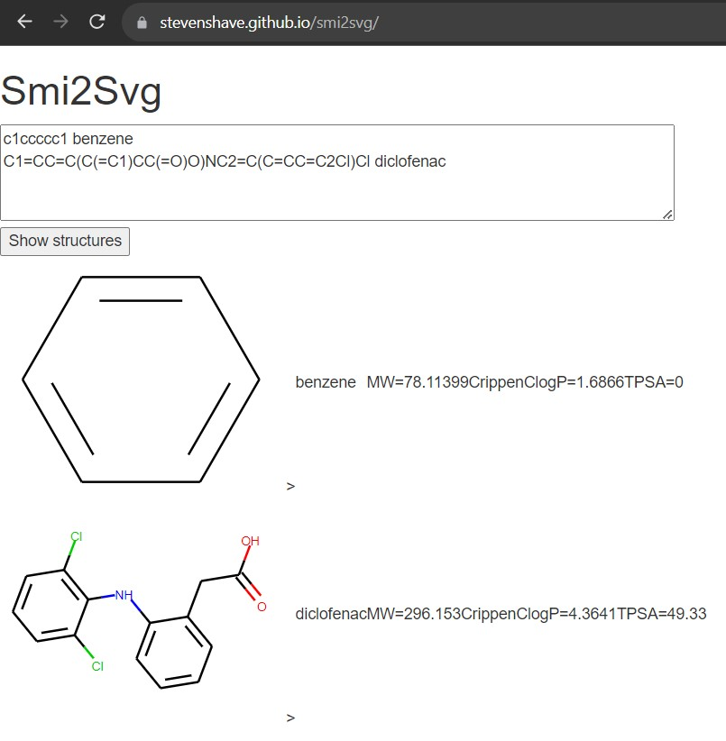

## Phenonaut

Data integration workflows for multiomics data take many forms across academia and industry. Efforts with limited resources often encountered in academia can easily fall short of data integration best practices for processing and combining high-content imaging, proteomics, metabolomics, and other omics data. We present Phenonaut, a Python software package designed to address the data workflow needs of migration, control, integration, and auditability in the application of literature and proprietary techniques for data source and structure agnostic workflow creation.

Reference: _Steven Shave, John Dawson, Abdullah Athar, Cuong Nguyen, Richard Kasprowicz, Neil Carragher, "Phenonaut: multiomics data integration for phenotypic space exploration." Bioinformatics, 2023._

<a href="https://doi.org/10.1093/bioinformatics/btad143"><i class="fas fa-fw fa-link"></i></a>
<a href="https://academic.oup.com/bioinformatics/article/39/4/btad143/7082955"><i class="fas fa-fw fa-newspaper"></i></a>
<a href="{{site.url}}/files/publications/2023_Phenonaut.pdf"><i class="fas fa-fw fa-file-pdf fa-xl" aria-hidden="true"></i></a>
<a href="https://github.com/CarragherLab/phenonaut"><i class="fab fa-fw fa-github zoom"></i></a>

 

## PyBindingCurve

PyBindingCurve is a Python package for simulation, plotting and fitting of experimental parameters to protein-ligand binding systems at equilibrium. In simple terms, the most basic functionality allows simulation of a two species binding to each other as a function of their concentrations and the dissociation constant (KD) between the two species.

Reference: _Steven Shave, Yan-Kai Chen, Nhan Pham, Manfred Auer, "PyBindingCurve, simulation, and curve fitting to complex binding systems at equilibrium." Journal of Chemical Information and Modeling, 2021._

<a href="https://doi.org/10.1021/acs.jcim.1c00216"><i class="fas fa-fw fa-link"></i></a>
<a href="https://pubs.acs.org/doi/10.1021/acs.jcim.1c00216"><i class="fas fa-fw fa-newspaper"></i></a>
<a href="{{site.url}}/files/publications/2021_PyBindingCurve.pdf"><i class="fas fa-fw fa-file-pdf fa-xl" aria-hidden="true"></i></a>
<a href="https://github.com/stevenshave/pybindingcurve"><i class="fab fa-fw fa-github zoom"></i></a>

 

## OpenFEPOPS

OpenFEPOPS is an open-source Python implementation of the FEature POint PharmacophoreS
(FEPOPS) molecular similarity technique enabling descriptor generation, comparison, and ranking of molecules in virtual screening
campaigns. Ligand based virtual screening is a fundamental approach undertaken to expand hit series or perform scaffold hopping whereby new chemistries and
synthetic routes are made available in efforts to remove undesirable molecular properties and
discover better starting points in the early stages of drug discovery. Typically, these techniques query hit molecules against proprietary, in-house, or publicly available repositories of small molecules in the hope of finding close matches which will display similar
activities to the query based on the molecular similarity principle which states that similar
molecules should have similar properties and make similar interactions.The central idea behind FEPOPS is reducing the complexity of molecules by merging
of local atomic environments and atom properties into ‘feature points’. This compressed feature point representation has been used to great effect as noted in literature, helping researchers identify active and potentially therapeutically valuable small molecules. By default, OpenFEPOPS uses literature reported parameters which show good performance in retrieval of active lead- and drug-like small molecules within virtual screening campaigns, with feature
points capturing charge, lipophilicity, and hydrogen bond acceptor and donor status.

Reference: _Chen, Y., Houston, D. R., Auer, M., & Shave, S. (2023). OpenFEPOPS: A Python implementation of the FEPOPS molecular similarity technique. Journal of Open Source Software, 8(91), 5763._

<a href="https://doi.org/10.21105/joss.05763"><i class="fas fa-fw fa-link"></i></a>
<a href="https://joss.theoj.org/papers/10.21105/joss.05763"><i class="fas fa-fw fa-newspaper"></i></a>
<a href="{{site.url}}/files/publications/2023_OpenFEPOPS.pdf"><i class="fas fa-fw fa-file-pdf fa-xl" aria-hidden="true"></i></a>
<a href="https://github.com/JustinYKC/FEPOPS"><i class="fab fa-fw fa-github zoom"></i></a>

 

## Smi2Svg

A useful little web tool I built using WASM compiled RDKit to quickly visualise molecules from their SMILES strings, runs completely in the browser.

<a href="https://stevenshave.github.io/smi2svg/"><i class="fas fa-fw fa-link"></i> https://stevenshave.github.io/smi2svg/</a>

